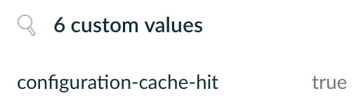

# Reporting Configuration Cache Hit in Build Scans
This plugin adds a custom value in the Build Scan representing a configuration
cache hit

## Usage
Root build.gradle(.kts):
```
plugins {
    id("io.github.cdsap.configurationcachehit") version "0.1.0"
}
```

## Implementation
The plugin defines a task `forcingConfigurationCacheRegister` that runs always first in the build execution.

Then, it creates a file output `build/.configuration_cache_hit` that is updated at the beginning of the build trough a `ValueSource`.
When the aux task is executed updates the file too with a `BuildService` that is compatible with Configuration Cache.

Finally, at the end of the Build, with another `ValueSource`, it retrieves the content of the output file. Knowing the
times that the file has been updated we retrieve the cache hit

## Output

